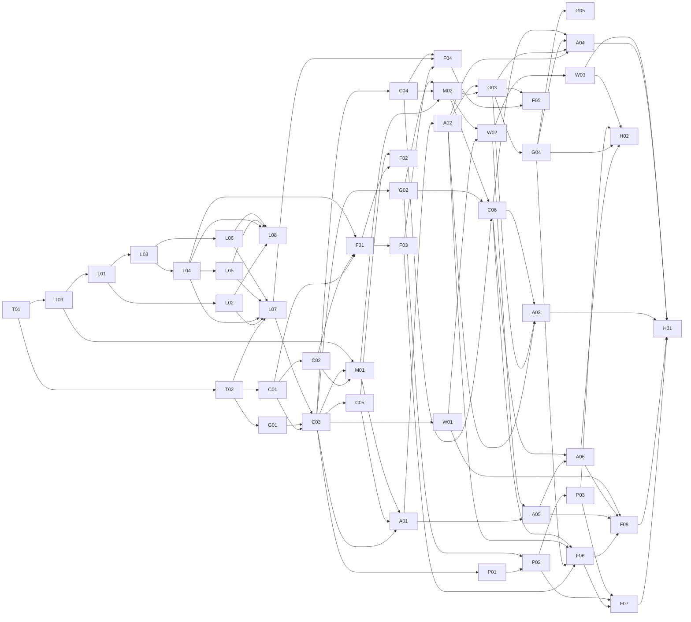

# Task index

46 tasks. Each file is self-contained: goal, spec sections to read, deliverables, interfaces, **tests to write first** (with IDs), acceptance criteria, and scope limits. Send each with `AGENT_PROMPT.md`.

Sizes: **S** ≤ ½ day, **M** ≈ 1 day, **L** ≈ 2–3 days of focused agent work.

## Waves (tasks within a wave can run in parallel)

| Wave | Tasks |
|---|---|
| 0 | T01 |
| 1 | T02, T03 |
| 2 | L01, C01, G01 |
| 3 | L02, L03, C02 |
| 4 | L04, L06 |
| 5 | L05, F01 |
| 6 | L07, L08 |
| 7 | C03 |
| 8 | C04, C05, G02, M01, P01, W01, F03 |
| 9 | M02, A01, P02, F02, F04 |
| 10 | C06, W02, A02, P03 |
| 11 | G03, W03, A05 |
| 12 | G04, A03, A06, F05 |
| 13 | G05 (optional), A04, F06 |
| 14 | F07, F08 |
| 15 | H01, H02 |

**Critical path:** T01 → T03 → L01 → L03 → L04 → L05 → L07 → C03 → C04 → M02 → W02 → A05 → A06 → F08 → H01.

## All tasks

| ID | Title | Epic | Depends on | Size |
|---|---|---|---|---|
| [T01](T01-monorepo-ci.md) | Monorepo, toolchains, CI | Foundation | — | S |
| [T02](T02-phoenix-skeleton.md) | Phoenix API skeleton | Foundation | T01 | M |
| [T03](T03-rust-workspace.md) | Rust workspace & binding scaffolds | Foundation | T01 | M |
| [L01](L01-lexer-parser.md) | Lexer & parser → AST | Language | T03 | L |
| [L02](L02-formatter.md) | Formatter | Language | L01 | M |
| [L03](L03-checker-ir.md) | Checker, IR, limits analysis | Language | L01 | L |
| [L04](L04-charter.md) | Charter renderer | Language | L03 | M |
| [L05](L05-differ.md) | Semantic differ | Language | L04 | M |
| [L06](L06-cedar-decide.md) | Cedar compiler & decide | Language | L03 | L |
| [L07](L07-bindings.md) | NIF + WASM bindings | Language | T02, L02, L04, L05, L06 | M |
| [L08](L08-cli-lang.md) | CLI language commands | Language | L02, L04, L05, L06 | M |
| [C01](C01-users-auth.md) | Users & authentication | Core | T02 | L |
| [C02](C02-pats-device-authplug.md) | PATs, device login, auth plug | Core | C01 | M |
| [C03](C03-orgs-specs-projection.md) | Orgs, spec versions, projection, membership | Core | C01, G01, L07 | L |
| [C04](C04-decisions-proposals.md) | Decisions engine & amendment proposals | Core | C03 | L |
| [C05](C05-activity-channels.md) | Activity log, PubSub, channels | Core | C03 | M |
| [C06](C06-goal-lifecycle.md) | Goal lifecycle, metrics, closing | Core | C04, G02, M02 | M |
| [G01](G01-ledger-core.md) | Ledger core | Ledger | T02 | L |
| [G02](G02-goal-funding-budgets.md) | Goal accounts, allocation, budgets | Ledger | G01, C03 | L |
| [G03](G03-expenses.md) | Expense claims & reimbursement records | Ledger | M02, A02 | M |
| [G04](G04-checkpoints-public-ledger.md) | Checkpoints & public ledger APIs | Ledger | G03 | M |
| [G05](G05-solana-anchor.md) | Solana checkpoint anchor (optional) | Ledger | G04 | S |
| [M01](M01-mandate-tokens.md) | Biscuit mandate tokens | Mandates | T03, C02, C03 | L |
| [M02](M02-authorize-spend.md) | Authorization service & spend flow | Mandates | M01, L07, C04, G02 | L |
| [P01](P01-stripe-onboarding.md) | Stripe Connect onboarding & webhooks | Payments | C02, C03 | M |
| [P02](P02-donations.md) | Donations, fees, refunds | Payments | P01, G02 | L |
| [P03](P03-reconciliation.md) | Stripe reconciliation | Payments | P02 | S |
| [W01](W01-secrets-prices.md) | Goal secrets & price catalog | Gateway | C02, C03 | M |
| [W02](W02-anthropic-gateway.md) | Anthropic Messages gateway | Gateway | W01, M02 | L |
| [W03](W03-openai-gateway.md) | OpenAI Chat Completions gateway | Gateway | W02 | M |
| [A01](A01-tasks-leases.md) | Tasks & leases | Agents | C03, C05, M01 | M |
| [A02](A02-evidence-uploads-review.md) | Evidence, uploads, review | Agents | A01 | M |
| [A03](A03-mcp-server.md) | MCP server | Agents | A02, G03, C06 | M |
| [A04](A04-cli-online.md) | CLI online commands | Agents | A02, G03, G04, C06, M01 | L |
| [A05](A05-hosted-runtime.md) | Hosted runtime (E2B) & sessions | Agents | A01, W01, W02, M01 | L |
| [A06](A06-kill-switch.md) | Kill switch | Agents | A05, C06 | M |
| [F01](F01-web-scaffold.md) | Web scaffold, design system, auth | Web | C01, C02, L04 | M |
| [F02](F02-world-map.md) | World map (PixiJS) | Web | F01, C03, C05 | L |
| [F03](F03-org-page.md) | Org page | Web | F01, C03 | M |
| [F04](F04-spec-editor.md) | Spec editor, proposals, create org | Web | F03, L07, C04 | L |
| [F05](F05-decisions-inbox.md) | Decisions & inbox | Web | F04, G03 | M |
| [F06](F06-goal-page.md) | Goal page & ledger | Web | F03, G04, A02, C06 | L |
| [F07](F07-donations-payments-ui.md) | Donation flow & payments settings | Web | F06, P02, P03 | M |
| [F08](F08-agents-admin-ui.md) | Agents, mandates, tokens, secrets, kill switch UI | Web | F06, A05, A06, W01 | M |
| [H01](H01-e2e.md) | End-to-end happy path | Hardening | all | L |
| [H02](H02-security-ops.md) | Security & ops hardening | Hardening | all backend | M |

## Dependency graph

## Cross-task contracts

- **Projection hooks** (C03): later tasks add behavior to spec activation by registering hook modules (G02 provisions goal/mandate accounts and allocations; M01 revokes tokens of revoked mandates). Hooks run inside the activation transaction; a failing hook rolls back activation.
- **Decision effects** (C04): `spend` (M02) and `close_goal` (C06) register effect modules.
- **Shared test vectors**: `crates/maru_core/tests/vectors/` (human formatting, decide, echo) and `apps/server/test/fixtures/ledger_vectors.json` (hash chain). Rust, Elixir, and TypeScript tests read the same files; never fork them.
